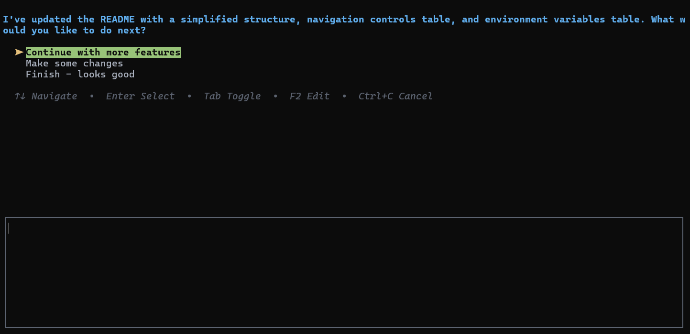

# Copilot Follow-up MCP Server

An MCP server that enables interactive follow-up questions in Copilot Chat without consuming additional message quota.

## Platform Support

- ✅ **Windows**: Fully tested and supported
- ⏳ **macOS**: Support pending (needs testing)
- ⏳ **Linux**: Support pending (needs testing)

## Why this exists

- ✅ Preserve Copilot quota: tool calls stay within one request
- 🔄 Keep conversations on track: AI must confirm steps through the tool
- 🌐 Cross-platform support: designed for Windows, macOS, and Linux

## Installation

### Prerequisites

- 🐍 Python 3.10 or higher
- ⚡ [uv](https://github.com/astral-sh/uv) package manager

### Setup

1. **Clone or download this project.**

2. **Install dependencies using uv:**
   ```bash
   uv sync
   ```

3. **Configure your MCP client to use this server:**

   Add the following to your MCP configuration:

   ```jsonc
   {
     "servers": {
       "copilot-followup": {
         "command": "uv",
         "args": [
           "run",
           "server.py"
         ],
         "cwd": "path/to/copilot-followup-mcp-server",
       }
     }
   }
   ```

4. **Restart VSCode** to load the MCP server.

## Usage

In VSCode Copilot Chat, the AI uses `ask_followup_question` to ask for input before finishing tasks or getting clarifications.

## Demo



## Navigation Controls

| Key | Action |
|-----|--------|
| `↑`/`↓` | Navigate through options |
| `Enter` | Select the highlighted option |
| `Tab` | Toggle focus between option list and text input area |
| `F2` | Edit the currently selected option text |
| **Type any character** | Automatically switches to text input mode (even when focused on options) |
| `Ctrl`+`C` | Cancel (when focused on option) / Paste clipboard (when in text area) |

## Configuration

### Environment Variables

| Variable | Description | Default |
|----------|-------------|---------|
| `FOLLOWUP_TIMEOUT_MINUTES` | User-response timeout in minutes (1-1440; <1 waits forever) | 5 |
| `CLOSE_TERMINAL` | Close terminal after completion (`true`/`false`) | `true` |

### Terminal Fallback Order

- Windows: PowerShell, then Command Prompt
- macOS: Terminal.app (via AppleScript)
- Linux: gnome-terminal → konsole → xfce4-terminal → xterm → terminator → x-terminal-emulator
